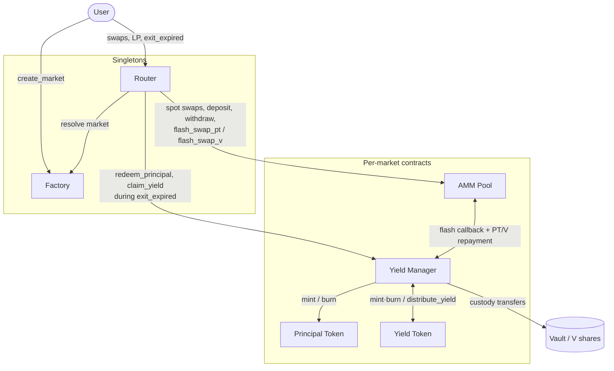
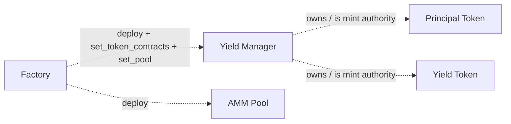

# YBC Architecture

This document is the system-level map of the YieldBack.Cash (YBC) protocol: the
contracts, how they call each other, the tokens they move, and the trust
boundaries between them. It is written for auditors and developers who need to
reconstruct the intended design before reading individual contracts.

For the protocol's economic purpose (splitting yield-bearing assets into fixed
and variable legs), see the top-level [README](../README.md). For trust
assumptions and invariants, see [SECURITY.md](./SECURITY.md).

---

## 1. Concepts and tokens

A **market** is one instance of the protocol, uniquely identified by
`(vault, maturity)`. Every market is fully self-contained: it deploys its own
yield manager, PT, YT, and AMM pool, and those touch only that market's vault.
Markets never share state, so one market can never affect another.

Three token types flow through a market:

| Symbol | Name | What it is |
|--------|------|-----------|
| **V** | Vault shares | The yield-bearing asset the user brings in — a 4626-style vault share token (e.g. a Blend vault). The unit of value that enters and leaves the protocol. |
| **PT** | Principal Token | Zero-coupon claim on principal. Redeemable 1:1 for face value in V **after** maturity. Fixed-yield leg. |
| **YT** | Yield Token | Claim on all variable yield accrued by the underlying V until maturity. Variable-yield leg. |

The core identity the protocol maintains:

```
depositing V  →  mints equal amounts of PT and YT
PT + YT together  →  always redeemable back into V (before maturity)
```

**Exchange rate.** The yield manager tracks an `exchange_rate` = assets per
`1e7` vault shares (1e7-scaled), read from the vault's `convert_to_assets`. It
is monotonic: it only ever increases, and **locks permanently at maturity**. All
mint/redeem math is denominated through this rate. See §5.

---

## 2. Contract inventory

| Contract | Crate | Role | Deployed |
|----------|-------|------|----------|
| **Factory** | `contracts/factory` | Deploys and records markets. Holds the canonical Wasm hashes for the other contracts. Upgradeable, admin-owned. | Once (singleton) |
| **Router** | `contracts/router` | Single stable user entrypoint. Resolves a market via the factory, then forwards to that market's AMM / yield manager. Holds no funds. | Once (singleton) |
| **Yield Manager (YM)** | `contracts/yield/yield_manager` | The vault custodian and PT/YT mint/burn authority. Custodies all deposited V, tracks the exchange rate, and drives the flash-swap callbacks. | Per market |
| **AMM (LiquidityPool)** | `contracts/amm/amm` | Constant-something curve trading **PT against V**. YT is never held by the pool — it is synthesized via flash swaps against PT. | Per market |
| **Principal Token (PT)** | `contracts/tokens/principal_token` | Standard token; mint/burn restricted to its YM. | Per market |
| **Yield Token (YT)** | `contracts/tokens/yield_token` | Token that also tracks and distributes accrued yield; mint/burn restricted to its YM. | Per market |

Interfaces live in the `*_interface` crates (`amm-interface`,
`yield_manager_interface`, `principal_token_interface`, `yield_token_interface`,
`vault/vault_interface`). These traits define each contract's public API surface
and generate the typed clients used for cross-contract calls.

---

## 3. Call graph

Users interact only with the two singletons (Router, Factory); everything
below them is per-market. The runtime call flow:



Double-headed arrows are the bidirectional relationships (the AMM↔YM flash
callback, and YM↔YT minting vs. `distribute_yield`). Deployment is a separate,
one-time concern. The Factory deploys each per-market contract and wires
them together:



**Design rule:** users interact through the **Router** (and the **Factory** to
create markets). The Router itself only authenticates the user, resolves the correct 
market through the Factory, and forwards the transaction. It never custodies funds. 
This keeps market addresses out of user-signed payloads and prevents a caller from 
pointing an operation at a pool the factory never deployed.

---

## 4. Lifecycles

### 4.1 Creating a market (permissionless)

`Factory::create_market(creator, vault, vault_type, maturity, current_apy, apy_min, apy_max, fee_apy)`

Anyone may create a market by authorizing as `creator`. The factory:

1. Validates the creation inputs (maturity must be in the future and within a bounded horizon, curve params 
    are validated by the AMM constructor). See SECURITY.md for the exact bounds and rationale.
2. Refuses a duplicate `(vault, maturity)`. Different maturities on the same vault coexist as independent markets.
3. Deploys the **YM** (constructor seeds the initial exchange rate from the vault).
4. Deploys **PT** and **YT** (owned by the YM), then calls `YM.set_token_contracts`.
5. Deploys the **AMM** with the APY-derived curve params, then calls
   `YM.set_pool` (one-shot) to register the pool as the trusted flash-swap driver.
6. Records the `Market` under `(vault, maturity)` and emits `MarketCreated`
   (including `creator`, so off-chain curation can decide which markets to surface).

A malicious vault can only harm users who opt into *its* market.

### 4.2 Split: deposit V → PT + YT

`YM::deposit(from, shares_amount)`

Pulls `shares_amount` V from the user into YM custody, then mints
`shares_amount × rate / 1e7` of **both** PT and YT to the user. Rejected after
maturity.

### 4.3 Recombine: PT + YT → V (before maturity)

`YM::redeem_combined(from, amount)` burns `amount` PT and `amount` YT, returns
`amount × 1e7 / rate` vault shares. The exact inverse of the split. Disabled at
maturity (post-maturity, PT is redeemed via `redeem_principal`).

### 4.4 Trading PT (spot)

PT ↔ V trades directly against the AMM's two reserves:

- `Router::swap_v_for_pt` → `AMM::swap_v_for_pt`
- `Router::swap_pt_for_v` → `AMM::swap_pt_for_v`

### 4.5 Trading YT (flash swaps)

The AMM holds no YT. YT is created/destroyed on the fly by pairing a PT flash
swap with a YM mint/burn.

**Buying YT — `Router::swap_v_for_yt` → `AMM::flash_swap_pt(receiver=YM, …)`:**

```
1. AMM advances v_from_pool vault shares to the YM (its payment for the PT it's buying)
2. AMM calls YM.on_flash_receive_pt(yt_out, v_from_pool, user, max_v_in, amm)
3. YM pulls max_v_in from the user, computes v_to_mint = yt_out*1e7/rate,
   user_cost = v_to_mint - v_from_pool  (the YT price), refunds the excess
4. YM mints yt_out PT (to itself) + yt_out YT (to the user)
5. YM transfers the yt_out PT to the AMM as repayment; asserts it leaked no PT
```

Net: the user pays only the YT price (bounded by `max_v_in`); the pool's V
advance covers the rest of the mint and is repaid in PT.

**Selling YT — `Router::swap_yt_for_v` → `AMM::flash_swap_v(receiver=YM, …)`:**

```
1. Router first transfers the user's yt_in YT to the YM
   (so the user's signed auth entry is a fixed-arg transfer, not pool-state-dependent)
2. AMM lends pt_borrowed = yt_in PT to the YM
3. AMM calls YM.on_flash_receive_v(pt_borrowed, v_owed, user, min_v_out, amm)
4. YM burns the pair (pt_borrowed PT + yt_in YT) → shares_returned = pt_borrowed*1e7/rate
5. YM repays v_owed vault shares to the AMM, sends the remainder (>= min_v_out) to the user
```

**Callback safety in one line:** only the registered pool can drive either
callback (`get_pool().require_auth()`), and every user-value movement is
independently authenticated against `user`, so a direct caller impersonating the
pool cannot mint or redeem against other depositors' V. The `rate` is passed as
a hint into every PT/YT call so the token contracts never call *back* into the YM
mid-callback (the host rejects that re-entry).

### 4.6 Providing liquidity

`Router::deposit` / `Router::withdraw` → `AMM::deposit` / `AMM::withdraw`.
LP positions are the pool's (PT, V) reserves; shares are tracked per user by the AMM.

### 4.7 Redeem at / after maturity

- `YM::redeem_principal(from, pt_amount)` — after maturity only. Burns PT, returns
  V at `max(live_vault_rate, locked_rate)` so PT always pays exactly face value;
  post-maturity appreciation stays in the YM as surplus, and the floor stops a
  vault-rate dip from overpaying.
- `Router::exit_expired(vault, maturity, to, lp_shares, min_shares_out)` — one-call
  unwind of an expired position: withdraws the LP position, redeems the user's
  entire PT balance via the YM, sweeps YT-accrued yield via `claim_yield`, and
  bounds the total V delivered by `min_shares_out`.

### 4.8 Zaps: entering and leaving in the base asset

Everything above is denominated in **V** (vault shares). The zaps let a user
arrive and leave holding only the vault's underlying asset (USDC, say) and never
think about shares at all. Each one wraps an existing operation in a vault
deposit or redeem:

| Zap | Path |
|-----|------|
| `zap_asset_for_pt` / `zap_pt_for_asset` | asset ↔ V ↔ PT (AMM spot) |
| `zap_asset_for_yt` / `zap_yt_for_asset` | asset ↔ V ↔ YT (flash swap) — **exceeds the per-transaction budget against a Blend vault; see below** |
| `zap_asset_for_split` / `zap_split_for_asset` | asset ↔ V ↔ PT+YT (YM mint/burn) |
| `zap_asset_for_lp` / `zap_lp_for_asset` | asset ↔ V ↔ LP position |
| `exit_expired_to_asset` | expired LP + PT + YT → asset — converts the caller's **whole** share balance up to `sweep_allowance`, so size that to the expected proceeds |

Four properties hold across all of them:

1. **The router still custodies nothing.** Every leg names the *user* as the
   token-holding party — the vault deposit passes the user as `from`, `receiver`
   and `operator` alike. A revert anywhere unwinds the whole chain and strands
   nothing, so the design rule in §3 survives unchanged.
2. **Slippage is bounded once, in base-asset terms.** A single `min_asset_out` /
   `max_asset_in` covers pool price *and* vault rate together — the only figure
   the user cares about. Per-leg share bounds are left deliberately wide.
3. **Nothing trusts a vault's self-reported amounts.** Every quantity crossing
   the vault boundary is measured as a balance delta before and after, because
   SEP-56 leaves fees and rounding to the implementation.
4. **The vault is called only through SEP-56.** `query_asset`, `convert_to_*`,
   `deposit` and `redeem` — nothing vault-specific, so any compliant vault can
   back a market without an adapter. The asset address is read live from
   `query_asset` (once per invocation) rather than snapshotted into the market
   record, so there is nothing to migrate and nothing that can go stale.

**Transaction budget.** A zap's cost is dominated by how many times it makes the
vault do real work. Against a lending vault like Blend, a deposit or redeem is a
pool submission — reserve updates, position updates, emissions accounting — and
even a rate *read* accrues interest and reads pool state. The AMM therefore loads
the vault rate once per invocation (`VaultRate` in `amm/src/vault.rs`) rather than
converting through a cross-contract call at each of the four points a swap needs
it; that one change is what brings `zap_asset_for_lp` inside the limit.

`exit_expired_to_asset` was over the limit whenever an LP position was involved,
and the fix illustrates the rule. It used to redeem twice — once for the shares
backing the caller's PT, once for the loose shares an LP withdrawal and a yield
claim leave behind. The yield manager now gathers those loose shares with a
`transfer_from` (cheap) and redeems the combined total once (expensive, but
once). Reordering the router so both payouts land before that call is what makes
it possible. Verified on-chain with a real LP position.

The cost of that is a wider allowance. The yield manager authenticates the
caller, so the amount it takes has to be a ceiling the caller signed in advance
rather than a delta measured mid-call — which means it converts the caller's
**entire** share balance up to `sweep_allowance`, including shares held for
unrelated markets. Size the allowance to the expected proceeds.

A cost driver worth knowing when reading this code: a YT `transfer` looks like
one token call but used to be two Blend pool reads, because `accrue_yield` runs
for both sender and recipient and each independently walked YT → YM → vault →
Blend for a rate that cannot change within a transaction. It is now fetched once
and shared. The equivalent saving still available on the YT paths is having the
AMM pass its already-loaded `VaultRate` into the flash callbacks instead of the
yield manager re-fetching it.

The two YT zaps remain out of reach, and the measurements say it is structural
rather than a missed optimisation: `zap_asset_for_pt` (two Blend submissions plus
an AMM swap) fits, while `zap_yt_for_asset` (one submission plus a flash swap)
does not — so the flash swap alone costs more than a deposit and a swap together.
Any asset-denominated YT route needs at least one submission to convert, so
removing vault work cannot close the gap. YT is therefore a two-transaction
product: the share-denominated `swap_v_for_yt` / `swap_yt_for_v` work normally,
with a vault deposit or redeem on either side. They fail at *simulation*, so a
user never spends a fee on one.

`zap_asset_for_lp` takes a caller-supplied `pt_to_buy`. The pool only accepts
its two legs in the current reserve ratio, and solving for the split that lands
on that ratio means duplicating the AMM's curve math in the router; instead the
frontend simulates for the figure and the router refunds whatever the pool
declines, so a slightly wrong number costs a refund rather than a failure.

### 4.9 What makes a vault zap-compatible

The protocol calls **four** vault functions in total — `query_asset`,
`convert_to_assets`, `deposit`, `redeem` — out of the eighteen SEP-56 declares.
That is deliberate: the smaller the surface, the more vaults can back a market.
So compatibility is rarely blocked by the interface. It is blocked by semantics
the standard leaves open.

The full list of what a vault must do, and how a violation shows up:

| # | Requirement | If violated |
|---|-------------|-------------|
| 1 | The four functions above, at SEP-56 names and signatures | Zaps revert immediately (unknown function). Nothing moves. |
| 2 | Shares are a SEP-41 token (`balance`, `transfer`, `transfer_from`, `approve`) — SEP-56 mandates this anyway | The YM cannot custody and the AMM cannot hold a reserve; the market itself won't work, zaps or not. |
| 3 | `redeem` burns **exactly** the shares requested, never clamping to the balance | Caught: the router asserts the exact burn and reverts. |
| 4 | Settlement is synchronous — assets have arrived when the call returns | Caught: the measured asset delta fails `min_asset_out`. |
| 5 | `deposit` is permissionless for the acting address (no signer gate, allowlist, or cap below the amount) | Entry zaps revert; exit zaps still work. A lopsided market. |
| 6 | Delegation, where supported, is allowance-based | Not exercised — the router passes one address for every role. Only matters if that ever changes (§4.8). |
| 7 | Share value never falls, and there are no exit fees | **Not caught.** See below. |

Requirements 1 through 5 all fail *loudly and atomically*: the transaction
reverts and the user keeps their position. A vault that violates any of them
produces a broken market, not a dangerous one.

Requirement 7 is different, and it is the one to actually worry about. The YM
treats its exchange rate as non-decreasing (§5) and derives PT face value from
`convert_to_assets`, which SEP-56 says nothing about reconciling with what
`redeem` really pays. A vault that loses value, or charges on the way out, leaves
PT over-valued against backing that cannot cover it — a slow solvency drift, not
an error. Nothing on-chain detects it.

Since `create_market` is permissionless, a vault failing any of these can already
back a market. That is not a security hole — markets are fully isolated per
`(vault, maturity)` — but "SEP-56 compliant" is not sufficient grounds to surface
a market in a UI. Checking 1–5 is cheap: simulate a small round trip against the
vault off-chain. Checking 7 is a judgement about the vault operator, not a test.

See [SECURITY.md](./SECURITY.md) for the trust model.

---

## 5. The exchange rate

The exchange rate is the spine of every mint/redeem calculation. Its behavior is
simple: it starts at the vault's rate when the market is created, only ever moves
up while the market is live, and freezes at maturity.

- **Before maturity:** each operation refreshes the rate to the vault's current
  rate, but never lets it drop below the stored value. So it climbs with the
  vault's yield and ignores any dips.
- **At maturity:** the rate freezes at whatever value it last reached. PT then
  redeems at the live vault rate but never below that frozen value, so the freeze
  acts as a floor on payout rather than a hard cap (§4.7).

This "only goes up, then freezes" behavior is what makes PT a fixed-value claim
and YT a claim on the appreciation between deposit and maturity.

---

## 6. Trust boundaries

| Boundary | What crosses it | Trust posture |
|----------|-----------------|---------------|
| User → Router | Signed auth for the acting address | Router authenticates `to`/`creator` before any market call. |
| Router/Factory → market contracts | Deployment + forwarding | Router forwards only to factory-recorded pools; markets are immutable per `(vault, maturity)`. |
| AMM ↔ YM (flash callbacks) | PT/V lent and repaid within one call | YM gates callbacks on `get_pool().require_auth()`; each user transfer is separately authed. |
| YM → Vault | Custody of all deposited V | **Vault is trusted on faith.** No on-chain proof it is honest; a malicious vault only harms its own market's opt-in users. |
| YM → PT/YT | mint/burn/claim_yield | PT/YT restrict these to their owning YM; the YM is the sole authority. |

The vault boundary is the protocol's principal external dependency and the main
subject of the threat model in [SECURITY.md](./SECURITY.md).

---

## 7. Code indexes for topics

Where each topic in this document lives in the source.

| Topic | Section | Code |
|-------|---------|------|
| Public API surface (all contracts) | §2 | the `*_interface` crate traits (`amm-interface`, `yield_manager_interface`, `principal_token_interface`, `yield_token_interface`, `vault/vault_interface`) |
| Market creation & deployment wiring | §4.1 | `contracts/factory/src/contract.rs` (`create_market`, `deploy_yield_manager_internal`, `deploy_pool_internal`) |
| Market records & lookup | §1, §3 | `contracts/factory/src/storage.rs`; `contracts/router/src/contract.rs` (`resolve_market`) |
| User routing / forwarding | §3 | `contracts/router/src/contract.rs` |
| Split & recombine (V ↔ PT+YT) | §4.2, §4.3 | `contracts/yield/yield_manager/src/contract.rs` (`deposit`, `redeem_combined`) |
| PT spot trading | §4.4 | `contracts/amm/amm/src/contract.rs` (`swap_v_for_pt`, `swap_pt_for_v`) |
| Curve / fixed-point math | §4.4 | `contracts/amm/amm/src/curve.rs`, `contracts/amm/amm/src/math.rs` |
| YT flash swaps (callbacks) | §4.5 | `contracts/router/src/contract.rs` (`swap_v_for_yt`, `swap_yt_for_v`); `contracts/yield/yield_manager/src/contract.rs` (`on_flash_receive_pt`, `on_flash_receive_v`); flash traits in `amm-interface` |
| Liquidity provision | §4.6 | `contracts/amm/amm/src/contract.rs` (`deposit`, `withdraw`) |
| Maturity redemption & exit | §4.7 | `contracts/yield/yield_manager/src/contract.rs` (`redeem_principal`); `contracts/router/src/contract.rs` (`exit_expired`); `contracts/tokens/yield_token/src/contract.rs` (`claim_yield`) |
| Base-asset zaps | §4.8 | `contracts/router/src/contract.rs` (`zap_*`, `exit_expired_to_asset`, and the `deposit_assets` / `redeem_shares` helpers); SEP-56 surface in `vault/vault_interface`; tested against OpenZeppelin's vault via `contracts/mocks/standard_vault` in `tests/integration/src/tests/zaps.rs` |
| Exchange rate | §1, §5 | `contracts/yield/yield_manager/src/contract.rs` (`update_exchange_rate`, `get_vault_exchange_rate`) |
| Events (off-chain integration) | — | each contract's `events.rs` |
```