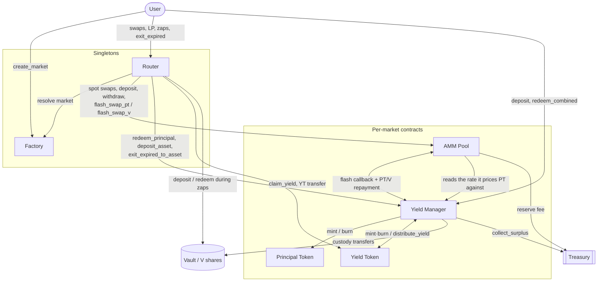
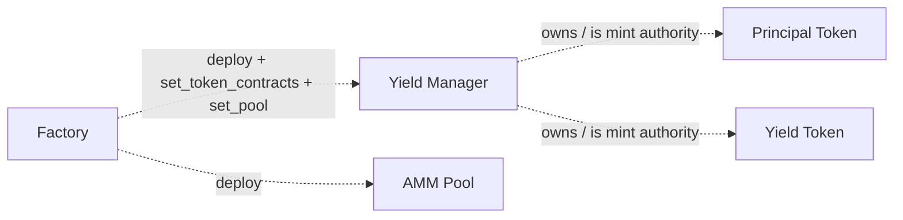

# YBC Architecture

This document is the system-level map of the YieldBack.Cash (YBC) protocol: the
contracts, how they call each other, the tokens they move, and the trust
boundaries between them. It is written for auditors and developers who need to
reconstruct the intended design before reading individual contracts.

For the protocol's economic purpose (splitting yield-bearing assets into fixed
and variable legs), see the top-level [README](../README.md). For trust
assumptions and invariants, see [SECURITY.md](./SECURITY.md).

---

## 1. Concepts and tokens

A **market** is one instance of the protocol, uniquely identified by
`(vault, maturity)`. Every market is fully self-contained: it deploys its own
yield manager, PT, YT, and AMM pool, and those touch only that market's vault.
Markets never share state, so one market can never affect another.

Three token types flow through a market:

| Symbol | Name | What it is                                                                                                                                              |
|--------|------|---------------------------------------------------------------------------------------------------------------------------------------------------------|
| **V** | Vault shares | The yield-bearing asset the user brings in, a 4626-style vault share token (e.g. a Blend vault). The unit of value that enters and leaves the protocol. |
| **PT** | Principal Token | Zero-coupon claim on principal. Redeemable 1:1 for face value in V **after** maturity. Fixed-yield leg.                                                 |
| **YT** | Yield Token | Claim on all variable yield accrued by the underlying V until maturity. Variable-yield leg.                                                             |

The core identity the protocol maintains:

```
depositing V  →  mints equal amounts of PT and YT
PT + YT together  →  always redeemable back into V (before maturity)
```

**Exchange rate.** The yield manager tracks an `exchange_rate` = assets per
`1e7` vault shares (1e7-scaled), read from the vault's `convert_to_assets`. It
is monotonic: it only ever increases, and **locks permanently at maturity**. All
mint/redeem math is denominated through this rate. See §6.

---

## 2. Contract inventory

| Contract | Crate | Role                                                                                                                                                                                                          | Deployed |
|----------|-------|---------------------------------------------------------------------------------------------------------------------------------------------------------------------------------------------------------------|----------|
| **Factory** | `contracts/factory` | Deploys and records markets. Holds the canonical Wasm hashes for the other contracts and the fee config each market snapshots at creation. Upgradeable; owned via OpenZeppelin `Ownable` (two-step transfer). | Once (singleton) |
| **Router** | `contracts/router` | Single stable user entrypoint. Resolves a market via the factory, then forwards to that market's AMM / yield manager. Holds no funds.                                                                         | Once (singleton) |
| **Yield Manager (YM)** | `contracts/yield/yield_manager` | The vault custodian and PT/YT mint/burn authority. Custodies all deposited V, tracks the exchange rate, and drives the flash-swap callbacks.                                                                  | Per market |
| **AMM** | `contracts/amm/amm` | Time-aware trading **PT against V**. YT is never held by the pool, it is traded via flash swaps against PT.                                                                                                   | Per market |
| **Principal Token (PT)** | `contracts/tokens/principal_token` | Fixed rate token, mimics a zero-coupon bond                                                                                                                                                                   | Per market |
| **Yield Token (YT)** | `contracts/tokens/yield_token` | Token that distributes accrued yield.                                                                                                                                                                         | Per market |
| **Treasury** | `contracts/treasury` | Protocol fee destination: receives the AMM's reserve-fee cut and the YM's post-maturity surplus. Charges nothing itself and holds no rate. Owner-only `withdraw`, upgradeable, `Ownable`.                     | Once (singleton) |

Interfaces live in the `*_interface` crates (`amm-interface`,
`yield_manager_interface`, `principal_token_interface`, `yield_token_interface`,
`vault/vault_interface`). These traits define each contract's public API surface
and generate the typed clients used for cross-contract calls.

---

## 3. Call graph

Almost everything users do goes through the two singletons (Router, Factory);
everything below them is per-market. The exceptions are noted under the diagram.
The runtime call flow:



Double-headed arrows are the bidirectional relationships (the AMM↔YM flash
callback, and YM↔YT minting vs. `distribute_yield`). Deployment is a separate,
one-time concern. The Factory deploys each per-market contract and wires
them together:



**Design rule:** every *trading* path goes through the **Router** (and the
**Factory** to create markets). The Router itself only authenticates the user,
resolves the correct market through the Factory, and forwards the transaction. It
never custodies funds. This keeps market addresses out of user-signed payloads and
prevents a caller from pointing an operation at a pool the factory never deployed.

The Router is the recommended path, never an enforced chokepoint. The yield
manager's `deposit` and `redeem_combined` stay public and directly callable —
markets are immutable, so they could not be closed off even if that were wanted,
and the YM authenticates the caller either way. `Router::split` and
`Router::recombine` (§4.2, §4.3) wrap them so the happy path still resolves the
market through the Factory and survives the market recreation that every
contract-level fix forces (§4.10).

---

## 4. Lifecycles

### 4.1 Creating a market

`Factory::create_market(creator, vault, vault_type, maturity, current_apy, apy_min, apy_max, fee_apy)`

Permissionless: any address may create a market by authorizing as `creator`.
Markets are keyed on `(vault, maturity)`, while the
same vault at different maturities yields independent, concurrently tradeable
markets. `maturity` must be in the future and inside a bounded horizon; the upper
bound catches unit errors such as milliseconds passed as seconds, which would
otherwise mint a market that never matures. See
[SECURITY.md](./SECURITY.md) for the exact bounds and rationale.

**Curve parameters.** The four APY arguments are 1e7-scaled and consumed by the
AMM constructor, which retains none of them directly:

| Argument | Stored as | Effect |
|----------|-----------|--------|
| `current_apy` | `last_implied_rate = ln(1 + current_apy)` | The rate the pool quotes at construction and re-anchors to after every trade (§4.4). Must satisfy `apy_min < current_apy < apy_max`. |
| `apy_min`, `apy_max` | `scalar_root = 2·ln(9) / (apy_max − apy_min)` | Only the band's *width* survives — neither endpoint is retained, and **nothing clamps the traded rate to `[apy_min, apy_max]`**. The width is curve steepness: at the p = 0.9 / 0.1 pins the logit term is ±ln(9), so the quoted APY sits at `current_apy ± (apy_max − apy_min)/2`, invariant in time to first order. |
| `fee_apy` | `fee_rate_root = ln(1 + fee_apy)` | Gives `fee_factor = e^(fee_rate_root·t) ≥ 1`, so the fee decays to zero at expiry (§5.1). |

**Deployment.** The factory then deploys, in order:

1. The **YM**, constructed with the factory's current `FeeConfig.treasury` and
   seeding its exchange rate from the vault.
2. **PT** and **YT**, both admin-owned by the YM, registered back through
   `set_token_contracts`.
3. The **AMM**, taking the derived curve params plus that same `treasury` and the
   current `reserve_fee_rate`, then registered on the YM through one-shot
   `set_pool` as the sole trusted flash-swap driver.

It records the `Market` under `(vault, maturity)` and publishes `MarketCreated`
with `creator`.

**Immutability.** A market's code and configuration are fixed at creation. Its
four contracts carry the Wasm hashes the factory held at that instant and expose
no upgrade entrypoint (§4.10); no curve parameter has a setter; and the fee
config is copied into the market's own storage rather than referenced, so a later
`set_fee_config` reaches only subsequent markets (§5.3). Changing any of it means
creating a new market.

The pool opens with both reserves and `total_shares` at zero, so it can price
nothing until an LP supplies both legs (§4.6).

**Vault trust.** Creation vets nothing beyond the `symbol()` read used to name the
tokens and the `convert_to_assets` probe that seeds the YM's rate, so a market may
be built over a vault that misbehaves or was never SEP-56 conformant. That is
contained rather than prevented: a market's YM, pool and tokens touch only its own
vault, so a malicious vault can only harm users who opt into *its* market. §4.9
enumerates the semantic requirements and how each violation surfaces. Which
markets reach users is an off-chain curation decision — the purpose of `creator`
in the event.

### 4.2 Split: deposit V → PT + YT

`Router::split(vault, maturity, to, shares_amount, allow_expiry)` →
`YM::deposit(from, shares_amount)`

Pulls `shares_amount` V from the user into YM custody, then mints
`shares_amount × rate / 1e7` of **both** PT and YT to the user. Rejected after
maturity.

The YM pulls with `transfer_from`, so it needs an allowance, and the Router
grants one on the caller's behalf — sized to exactly `shares_amount` and consumed
in full, leaving no residue. That is what keeps the YM's address out of the
frontend: the wallet obtains the approve entry by simulating the Router call and
signs it without having resolved the market itself. `allow_expiry` is an absolute
ledger the caller chooses, and must never be derived on-chain — see §4.8 and the
header of `tests/integration/src/tests/zap_auth_entries.rs`.

### 4.3 Recombine: PT + YT → V (before maturity)

`Router::recombine(vault, maturity, to, amount)` → `YM::redeem_combined(from,
amount)` burns `amount` PT and `amount` YT, returns `amount × 1e7 / rate` vault
shares. The exact inverse of the split. Disabled at maturity (post-maturity, PT
is redeemed via `redeem_principal`).

No allowance on this side: the YM burns the pair straight out of the caller's
balances, and the PT burn — both arguments caller-chosen — is what authenticates
them. The YT burn carries the live exchange rate but is admin-gated rather than
holder-gated, so that rate never enters the user's signature.

### 4.4 Trading PT (spot)

PT ↔ V trades directly against the AMM's two reserves:

- `Router::swap_v_for_pt` → `AMM::swap_v_for_pt`
- `Router::swap_pt_for_v` → `AMM::swap_pt_for_v`

Both charge the curve's `fee_apy`. Most of it stays in the reserves, which is how
LPs are paid; a configured cut is remitted to the treasury inside the same call
(§5.1).

### 4.5 Trading YT (flash swaps)

The AMM holds no YT. YT is created/destroyed on the fly by pairing a PT flash
swap with a YM mint/burn.

**Buying YT — `Router::swap_v_for_yt` → `AMM::flash_swap_pt(receiver=YM, …)`:**

```
1. AMM advances v_from_pool vault shares to the YM (its payment for the PT it's buying)
2. AMM calls YM.on_flash_receive_pt(yt_out, v_from_pool, user, max_v_in, vault_rate, amm)
   — vault_rate is the rate the AMM already loaded to price this trade, which it
     read from the YM itself (§4.8)
3. YM computes v_to_mint = yt_out*1e7/rate and user_cost = v_to_mint - v_from_pool
   (the YT price), checks it against max_v_in, then pulls max_v_in from the user
   and refunds the excess
4. YM mints yt_out PT (to itself) + yt_out YT (to the user)
5. YM transfers the yt_out PT to the AMM as repayment; asserts it leaked no PT
```

Net: the user pays only the YT price (bounded by `max_v_in`); the pool's V
advance covers the rest of the mint and is repaid in PT.

**Selling YT — `Router::swap_yt_for_v` → `AMM::flash_swap_v(receiver=YM, …)`:**

```
1. Router first transfers the user's yt_in YT to the YM
   (so the user's signed auth entry is a fixed-arg transfer, not pool-state-dependent)
2. AMM lends pt_borrowed = yt_in PT to the YM
3. AMM calls YM.on_flash_receive_v(pt_borrowed, v_owed, user, min_v_out, vault_rate, amm)
4. YM burns the pair (pt_borrowed PT + yt_in YT) → shares_returned = pt_borrowed*1e7/rate
5. YM repays v_owed vault shares to the AMM, sends the remainder (>= min_v_out) to the user
```

**Callback safety in one line:** only the registered pool can drive either
callback (`get_pool().require_auth()`), and every user-value movement is
independently authenticated against `user`, so a direct caller impersonating the
pool cannot mint or redeem against other depositors' V. The `rate` is passed as
a hint into every **YT** call (`mint`, `burn_with_rate`, `transfer_with_rate`) so
the YT contract never calls *back* into the YM mid-callback — the host rejects
that re-entry. PT takes no such hint; it holds no rate-dependent state.

That same auth gate is what makes the inbound `vault_rate` safe. It reaches
security-critical arithmetic — it divides `v_to_mint`, so an inflated value would
mint against fewer shares — but it can only originate from the registered pool,
which is factory-deployed and immutable. And because the pool sources the figure
from `YM::get_exchange_rate` (§4.8), what arrives is the yield manager's *own*
stored rate making a round trip: re-applying it is idempotent and the
non-decreasing floor is a no-op. That is a stronger guarantee than the one this
used to rest on — the documented-but-unenforceable promise that the pool passed a
raw vault reading and never an already-ratcheted one, whose failure direction (a
value too *high*) would have ratcheted the stored rate up permanently.

### 4.6 Providing liquidity

`Router::deposit` / `Router::withdraw` → `AMM::deposit` / `AMM::withdraw`.
LP positions are the pool's (PT, V) reserves; shares are tracked per user by the AMM.

### 4.7 Redeem at / after maturity

- `YM::redeem_principal(from, pt_amount)` — after maturity only. Burns PT, returns
  V at `max(live_vault_rate, locked_rate)` so PT always pays exactly face value;
  the floor stops a vault-rate dip from overpaying. The shares freed by redeeming
  at the higher live rate are booked as protocol **surplus** (§5.2) rather than
  left loose in custody for the next redeemer to absorb.
- `Router::exit_expired(vault, maturity, to, lp_shares, min_shares_out)` — one-call
  unwind of an expired position: withdraws the LP position, redeems the user's
  entire PT balance via the YM, sweeps YT-accrued yield via `claim_yield`, and
  bounds the total V delivered by `min_shares_out`.

### 4.8 Zaps: entering and leaving in the base asset

Everything above is denominated in **V** (vault shares). The zaps let a user
arrive and leave holding only the vault's underlying asset (USDC, say) and never
think about shares at all. Each one wraps an existing operation in a vault
deposit or redeem:

| Zap | Path |
|-----|------|
| `zap_asset_for_pt` / `zap_pt_for_asset` | asset ↔ V ↔ PT (AMM spot) |
| `zap_asset_for_yt` / `zap_yt_for_asset` | asset ↔ V ↔ YT (flash swap) |
| `zap_asset_for_split` / `zap_split_for_asset` | asset ↔ V ↔ PT+YT (YM mint/burn) |
| `zap_asset_for_lp` / `zap_lp_for_asset` | asset ↔ V ↔ LP position |
| `exit_expired_to_asset` | expired LP + PT + YT → asset — converts the caller's **whole** share balance up to `sweep_allowance`, so size that to the expected proceeds |

Four properties hold across all of them:

1. **The router still custodies nothing.** No leg leaves value sitting at the
   router, and a revert anywhere unwinds the whole chain and strands nothing, so
   the design rule in §3 survives unchanged. Two legs do use SEP-56's delegation
   roles rather than naming the user for all three: the entry deposit passes the
   user as `from`, `receiver` and `operator` alike, but the **sweep** drives
   `redeem` with the router as `operator` against a user-signed share allowance,
   and `YM::deposit_asset` names the **YM** as `receiver` so minted shares land
   straight in custody. Both still pay the user; the delegated authority is only
   to trigger the conversion, never to redirect it (§4.9, requirement 6).
2. **Slippage is bounded once, in base-asset terms.** A single `min_asset_out` /
   `max_asset_in` covers pool price *and* vault rate together — the only figure
   the user cares about. Per-leg share bounds are left deliberately wide.
3. **Nothing trusts a vault's self-reported amounts.** Every quantity crossing
   the vault boundary is measured as a balance delta before and after, because
   SEP-56 leaves fees and rounding to the implementation.
4. **The vault is called only through SEP-56.** `query_asset`,
   `convert_to_assets`, `deposit` and `redeem` — four functions, nothing
   vault-specific, so any compliant vault can back a market without an adapter.
   (`convert_to_shares` was declared once for symmetry and then removed: nothing
   called it, blend-vault-v2 does not implement it, and an uncalled declaration
   reads as a requirement.) The asset address is read live from
   `query_asset` (once per invocation) rather than snapshotted into the market
   record, so there is nothing to migrate and nothing that can go stale.

**Transaction budget.** A zap's cost is dominated by how many times it makes the
vault do real work. Against a lending vault like Blend, a deposit or redeem is a
pool submission — reserve updates, position updates, emissions accounting — and
even a rate *read* accrues interest and reads pool state. The AMM therefore loads
the rate once per invocation (`VaultRate` in `amm/src/vault.rs`) rather than
converting through a cross-contract call at each of the four points a swap needs
it; that one change is what brings `zap_asset_for_lp` inside the limit.

`exit_expired_to_asset` was over the limit whenever an LP position was involved,
and the fix illustrates the rule. It used to redeem twice — once for the shares
backing the caller's PT, once for the loose shares an LP withdrawal and a yield
claim leave behind. The yield manager now gathers those loose shares with a
`transfer_from` (cheap) and redeems the combined total once (expensive, but
once). Reordering the router so both payouts land before that call is what makes
it possible. Verified on-chain with a real LP position.

The cost of that is a wider allowance. The yield manager authenticates the
caller, so the amount it takes has to be a ceiling the caller signed in advance
rather than a delta measured mid-call — which means it converts the caller's
**entire** share balance up to `sweep_allowance`, including shares held for
unrelated markets. Size the allowance to the expected proceeds.

The governing principle is that **the rate is read once and threaded downward**,
never re-fetched by each layer. A YT `transfer` used to cost two Blend
reads because `accrue_yield` runs for both sender and recipient and each walked
YT → YM → vault → Blend independently; it now fetches once and shares. The yield
manager passes the rate to the yield token for the same reason. And the AMM hands
its already-loaded `VaultRate` to the flash callbacks, so the yield manager does
not repeat the read — `update_exchange_rate` is split so the vault read is
separable from the policy, with the non-decreasing floor, the maturity lock and
the storage write all staying in the yield manager.

That last change is what brought the YT zaps inside the budget. **All eight zaps
and all four share-denominated swaps simulated successfully against a Blend
vault**, the heaviest being `zap_asset_for_yt` at ~32M instructions. Treat those
figures as dated: they were taken before the rate source changed (below), which
adds roughly 4,400 stroops to every priced call, and they have not been
re-measured. Nothing in CI backs them either — `tests/blend` is excluded from the
workspace until `blend-contract-sdk` supports soroban-sdk 26.

**Where the rate comes from.** The AMM does *not* read the vault. `VaultRate::load`
calls `YM::get_exchange_rate`, so the figure it hands down to the flash callbacks
is the yield manager's own rate returning to it.

This was the other way round until `4d13e76`, and reversing it was a fix rather
than an optimisation. PT is a claim on `face / rate` vault shares where `rate` is
the **yield manager's**, because that is what `redeem_principal` settles at; the
vault's own rate never enters PT's payout. The two agree for as long as the vault
only appreciates, which is what hid the difference. They separate the moment a
vault loses value: the YM high-water-marks while a direct vault read follows it
down, so the pool valued PT face at the depressed rate while the YM would only
ever redeem at the high-water mark. That overpays every PT seller, and lets anyone
mint PT from the YM at its rate and sell it to the pool in unlimited size.
`tests/integration/src/tests/rate_divergence.rs` pins the behaviour.

The cost is one extra frame — `ym.get_exchange_rate` measured 12,564 stroops
against the live Blend vault versus 8,124 for the `vault.convert_to_assets` it
replaced. The count of underlying vault reads is unchanged at one per invocation,
and past maturity it is strictly cheaper: the YM's rate is locked, so it answers
from its own storage without touching the vault at all.

Two things about the rate hint are load-bearing, and both are documented at
`update_exchange_rate_from`:

* **Direction.** The value flows from the contract that *owns* the number the
  protocol settles at to the one that merely prices against it — never the
  reverse. That contract is the yield manager, so the hint is its own figure
  round-tripping: applying it is idempotent and the non-decreasing floor a no-op,
  and the pool cannot supply any other value. The previous arrangement could only
  document its precondition, and that precondition's failure direction (a value
  too *high*) would have ratcheted the stored rate up permanently.
* **Pairing.** The receiver's vault must be the caller's vault. Guaranteed by
  construction: `create_market` threads one `vault` value into both, and
  `set_pool` is one-shot.

The `amm` and `yield_manager` WASM changed the callback ABI together and are not
interchangeable with their predecessors — see §4.10.

An earlier revision of this document concluded the YT zaps were *structurally*
out of reach, reasoning that the flash swap alone cost more than a deposit plus a
swap. That was wrong twice over: the comparison was made against a market frozen
on pre-fix bytecode, and it reasoned about CPU when the binding limit is memory.
`docs/YT_ZAP_BUDGET.md` records the measurements.

`zap_asset_for_lp` takes a caller-supplied `pt_to_buy`. The pool only accepts
its two legs in the current reserve ratio, and solving for the split that lands
on that ratio means duplicating the AMM's curve math in the router; instead the
frontend simulates for the figure and the router refunds whatever the pool
declines, so a slightly wrong number costs a refund rather than a failure.

### 4.9 What makes a vault zap-compatible

The protocol calls **four** vault functions in total — `query_asset`,
`convert_to_assets`, `deposit`, `redeem` — out of the eighteen SEP-56 declares.
That is deliberate: the smaller the surface, the more vaults can back a market.
So compatibility is rarely blocked by the interface. It is blocked by semantics
the standard leaves open.

The full list of what a vault must do, and how a violation shows up:

| # | Requirement | If violated |
|---|-------------|-------------|
| 1 | The four functions above, at SEP-56 names and signatures | Zaps revert immediately (unknown function). Nothing moves. |
| 2 | Shares are a SEP-41 token (`balance`, `transfer`, `transfer_from`, `approve`) — SEP-56 mandates this anyway | The YM cannot custody and the AMM cannot hold a reserve; the market itself won't work, zaps or not. |
| 3 | `redeem` burns **exactly** the shares requested, never clamping to the balance | Caught only in asset terms. Nothing checks the share burn directly, so a clamp surfaces as a short payout tripping `min_asset_out` (or `max_asset_in` on the way in). |
| 4 | Settlement is synchronous — assets have arrived when the call returns | Caught: the measured asset delta fails `min_asset_out`. |
| 5 | `deposit` is permissionless for the acting address (no signer gate, allowlist, or cap below the amount) | Entry zaps revert; exit zaps still work. A lopsided market. |
| 6 | Delegation is allowance-based: an `operator` may act on an owner's shares up to an approved amount | **Exercised on every sweeping zap.** `sweep_gained_shares` calls `redeem` with the router as `operator` against a user-signed share allowance, and `YM::deposit_asset` names the YM as `receiver` (§4.8). A vault that ignores operator allowances reverts those legs. |
| 7 | Share value never falls, and there are no exit fees | **Not caught.** See below. |

Requirements 1 through 5 all fail *loudly and atomically*: the transaction
reverts and the user keeps their position. A vault that violates any of them
produces a broken market, not a dangerous one. Note that 3 and 4 are caught by
the caller's slippage bound rather than by a dedicated check, so a violation
smaller than the tolerance the user signed passes silently — the bound is the
guarantee, not the detector.

Requirement 7 is different, and it is the one to actually worry about. The YM
treats its exchange rate as non-decreasing (§6) and derives PT face value from
`convert_to_assets`, which SEP-56 says nothing about reconciling with what
`redeem` really pays. A vault that loses value, or charges on the way out, leaves
PT over-valued against backing that cannot cover it — a slow solvency drift, not
an error. Nothing on-chain detects it.

Since `create_market` is permissionless, a vault failing any of these can already
back a market. That is not a security hole — markets are fully isolated per
`(vault, maturity)` — but "SEP-56 compliant" is not sufficient grounds to surface
a market in a UI. Checking 1–5 is cheap: simulate a small round trip against the
vault off-chain. Checking 7 is a judgement about the vault operator, not a test.

See [SECURITY.md](./SECURITY.md) for the trust model.

### 4.10 Markets are immutable — WASM is bound at creation

`create_market` stamps whatever hashes the factory holds **at that moment** into
the market's YM, PT, YT and pool. None of those four expose an upgrade
entrypoint, so a market can never adopt a later version. Only the singletons can
be replaced: the factory and the treasury each have an owner-only `upgrade`, and
the router — which has none — is simply redeployed, since it resolves markets
through the factory and a fresh one works against existing markets untouched. The
treasury's *address* is baked into every market and is therefore as immutable as
the market itself; control over it rotates by transferring ownership.

Three consequences that have each caused real problems:

1. **Install order silently determines what a market can do.** A market created
   between installing contract A and contract B gets new-A and old-B, forever.
   This has already killed a market: one created two minutes after a new AMM and
   two days before a new YM/YT was permanently missing `exit_expired_to_asset`,
   whose YM never had the function, and its YT still performed a redundant rate
   lookup on every transfer. It has since been retired and dropped from the
   registry. **Always install every WASM, verify
   `factory.get_wasm_hashes()`, and only then `create_market`.**
2. **A market's deployed hashes can silently diverge from the registry.**
   `deployments.testnet.json` records what was *installed*, not what any given
   market *runs*. To check a live market, fetch its contracts and hash them —
   `stellar contract fetch --id <ym> | sha256sum` — rather than trusting the
   registry. Market entries do record a partial hash for this reason (today only
   `amm_wasm_hash`), but the recorded set is incomplete, so hashing the live
   contracts stays the only authoritative check.
3. **Contracts that change together must ship together.** The AMM and YM share
   the flash-callback ABI. Installing one without the other yields markets whose
   flash swaps fail at the callback. They are versioned as a pair.

Because markets are immutable, essentially every contract-level fix requires
creating new markets. Bundle them: one migration can carry several changes at
barely more cost than one.

---

## 5. Protocol fees and the treasury

The protocol takes value in two places, and both settle into the same passive
sink.

**The treasury** (`contracts/treasury`) does no fee accounting at all. It has a
balance and an owner-only `withdraw`; the contracts that charge fees simply
transfer tokens to its address. Rates live in the contracts that charge them,
snapshotted per market at creation, so the treasury owner holds no lever over a
live market — only over funds already collected. Ownership is OpenZeppelin
`Ownable` with a two-step transfer (propose + accept, with a deadline), because a
mistaken one-step handoff would strand every fee it holds. `renounce_ownership`
exists and is self-defeating here: it permanently bricks `withdraw`.

### 5.1 The reserve fee (AMM)

Every spot swap and every flash swap charges the curve's `fee_apy`. Most of it is
left in the pool's reserves, which is how LPs are paid. A configured fraction —
`reserve_fee_rate`, 1e7-scaled and capped at 50% *of the fee*, not of the trade —
is converted to vault shares and transferred to the treasury inside the same call
(`remit_reserve_fee`), then subtracted from the reserve so LP accounting never
sees it.

On the flash paths the remittance happens *after* the pool's repayment asserts,
so those asserts see only the priced amounts and a fee cut can never be mistaken
for a shortfall.

### 5.2 Surplus (yield manager)

PT is a claim on *face value*, so PT redeemed after maturity pays at
`max(live_vault_rate, locked_rate)` — the live rate whenever the vault has kept
appreciating. Its backing was reserved at the locked rate, so settling at the
higher one frees shares. That difference is the post-maturity interest a redeemer
forgoes by redeeming late, and the YM books it as `surplus_shares` rather than
leaving it loose in custody, where whoever redeemed next would silently absorb it.

`distribute_yield` books surplus on the same principle: YT positions freeze in
*asset* value at maturity, so once the rate is locked a claim pays the shares that
asset value buys at the live rate — fewer shares as the vault keeps appreciating,
with the difference banked.

`YM::collect_surplus` sweeps the accumulated shares to the market's treasury. It
is permissionless, because it can only ever move surplus to the one address baked
in at creation; there is nothing to gate.

### 5.3 Configuration

The factory holds a `FeeConfig { treasury, reserve_fee_rate }` and copies it into
each market at creation (§4.1). `set_fee_config` is owner-only and validates
`reserve_fee_rate` against the same cap the AMM constructor enforces, so a bad
config fails at config time rather than on the next `create_market`. Because the
values are snapshotted and neither the YM nor the pool exposes a setter, a change
is **prospective only**: it reaches markets created afterwards and can never
reach a live one.

---

## 6. The exchange rate

The exchange rate is the spine of every mint/redeem calculation. Its behavior is
simple: it starts at the vault's rate when the market is created, only ever moves
up while the market is live, and freezes at maturity.

- **Before maturity:** each operation refreshes the rate to the vault's current
  rate, but never lets it drop below the stored value. So it climbs with the
  vault's yield and ignores any dips.
- **At maturity:** the rate freezes at whatever value it last reached. PT then
  redeems at the live vault rate but never below that frozen value, so the freeze
  acts as a floor on payout rather than a hard cap (§4.7).

This "only goes up, then freezes" behavior is what makes PT a fixed-value claim
and YT a claim on the appreciation between deposit and maturity.

---

## 7. Trust boundaries

| Boundary | What crosses it | Trust posture |
|----------|-----------------|---------------|
| User → Router | Signed auth for the acting address | Router authenticates `to`/`creator` before any market call. |
| Router/Factory → market contracts | Deployment + forwarding | Router forwards only to factory-recorded pools; markets are immutable per `(vault, maturity)`. |
| User → Router (as vault operator) | A signed, expiring share allowance | The router drives `redeem` with a freshly measured amount, but the vault pays `to` — the delegated power is to convert, never to redirect. Bounded by `sweep_allowance`, dead at `sweep_expiry`. |
| AMM ↔ YM (flash callbacks) | PT/V lent and repaid within one call | YM gates callbacks on `get_pool().require_auth()`; each user transfer is separately authed. |
| AMM → YM (pricing) | The exchange rate PT settles at | One-directional read of `get_exchange_rate`. The pool applies no policy to it and cannot write it back; what it hands to the callbacks is the YM's own value (§4.8). |
| YM → Vault | Custody of all deposited V | **Vault is trusted on faith.** No on-chain proof it is honest; a malicious vault only harms its own market's opt-in users. |
| YM → PT/YT | mint/burn/claim_yield | PT/YT restrict these to their owning YM; the YM is the sole authority. |
| AMM / YM → Treasury | Reserve fee and surplus, as plain transfers | Address snapshotted at creation and immutable. The treasury owner can withdraw collected fees but holds no rate and no power over a live market (§5). |
| Factory owner | `set_wasm_hashes`, `set_fee_config`, `upgrade` | Governs only *future* markets — live ones stamped their hashes and fee config at creation (§4.10). `Ownable`, two-step transfer. |

The vault boundary is the protocol's principal external dependency and the main
subject of the threat model in [SECURITY.md](./SECURITY.md).

---

## 8. Code indexes for topics

Where each topic in this document lives in the source.

| Topic | Section | Code |
|-------|---------|------|
| Public API surface (all contracts) | §2 | the `*_interface` crate traits (`amm-interface`, `yield_manager_interface`, `principal_token_interface`, `yield_token_interface`, `vault/vault_interface`) |
| Market creation & deployment wiring | §4.1 | `contracts/factory/src/contract.rs` (`create_market`, `deploy_yield_manager_internal`, `deploy_pool_internal`) |
| Market records & lookup | §1, §3 | `contracts/factory/src/storage.rs`; `contracts/router/src/contract.rs` (`resolve_market`) |
| User routing / forwarding | §3 | `contracts/router/src/contract.rs` |
| Split & recombine (V ↔ PT+YT) | §4.2, §4.3 | `contracts/router/src/contract.rs` (`split`, `recombine`); `contracts/yield/yield_manager/src/contract.rs` (`deposit`, `redeem_combined`); auth trees pinned in `tests/integration/src/tests/router_split.rs` |
| PT spot trading | §4.4 | `contracts/amm/amm/src/contract.rs` (`swap_v_for_pt`, `swap_pt_for_v`) |
| Curve / fixed-point math | §4.4 | `contracts/amm/amm/src/curve.rs`, `contracts/amm/amm/src/math.rs` |
| YT flash swaps (callbacks) | §4.5 | `contracts/router/src/contract.rs` (`swap_v_for_yt`, `swap_yt_for_v`); `contracts/yield/yield_manager/src/contract.rs` (`on_flash_receive_pt`, `on_flash_receive_v`); flash traits in `amm-interface` |
| Liquidity provision | §4.6 | `contracts/amm/amm/src/contract.rs` (`deposit`, `withdraw`) |
| Maturity redemption & exit | §4.7 | `contracts/yield/yield_manager/src/contract.rs` (`redeem_principal`); `contracts/router/src/contract.rs` (`exit_expired`); `contracts/tokens/yield_token/src/contract.rs` (`claim_yield`) |
| Base-asset zaps | §4.8 | `contracts/router/src/contract.rs` (`zap_*`, `exit_expired_to_asset`, and the `deposit_assets` / `redeem_shares` helpers); SEP-56 surface in `vault/vault_interface`; tested against OpenZeppelin's vault via `contracts/mocks/standard_vault` in `tests/integration/src/tests/zaps.rs`; frontend-facing parameter guidance in `docs/FRONTEND_ZAPS.md` |
| Rate threading & sourcing | §4.5, §4.8 | `contracts/amm/amm/src/vault.rs` (`VaultRate` — loaded from the YM, once per invocation); `amm-interface` (`vault_rate` on both flash callbacks); `yield_manager/src/contract.rs` (`update_exchange_rate_from` — the vault read split from the policy); `tests/integration/src/tests/rate_divergence.rs` (why the pool must not price off the vault) |
| Protocol fees & treasury | §5 | `contracts/treasury/src/contract.rs`; `contracts/amm/amm/src/contract.rs` (`reserve_fee_in_shares`, `remit_reserve_fee`); `contracts/yield/yield_manager/src/contract.rs` (`collect_surplus`, and the surplus booking in `redeem_principal` / `distribute_yield`); `contracts/factory/src/contract.rs` (`FeeConfig`, `set_fee_config`) |
| Transaction budget | §4.8, §4.10 | `docs/YT_ZAP_BUDGET.md` — per-leg cost model, measured instruction counts per entrypoint, and why the binding limit is memory rather than CPU |
| Market immutability | §4.10 | `contracts/factory/src/contract.rs` (`create_market` stamps hashes at creation); `deployments/deployments.testnet.json` (per-market hashes) |
| Exchange rate | §1, §6 | `contracts/yield/yield_manager/src/contract.rs` (`update_exchange_rate`, `get_vault_exchange_rate`) |
| Events (off-chain integration) | — | each contract's `events.rs` |
